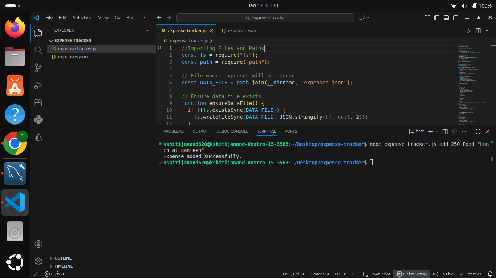
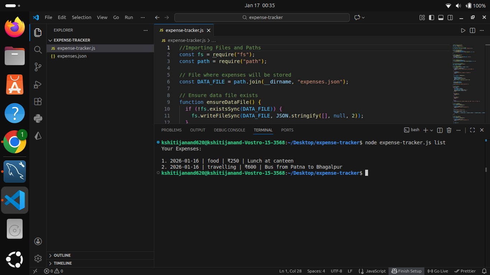
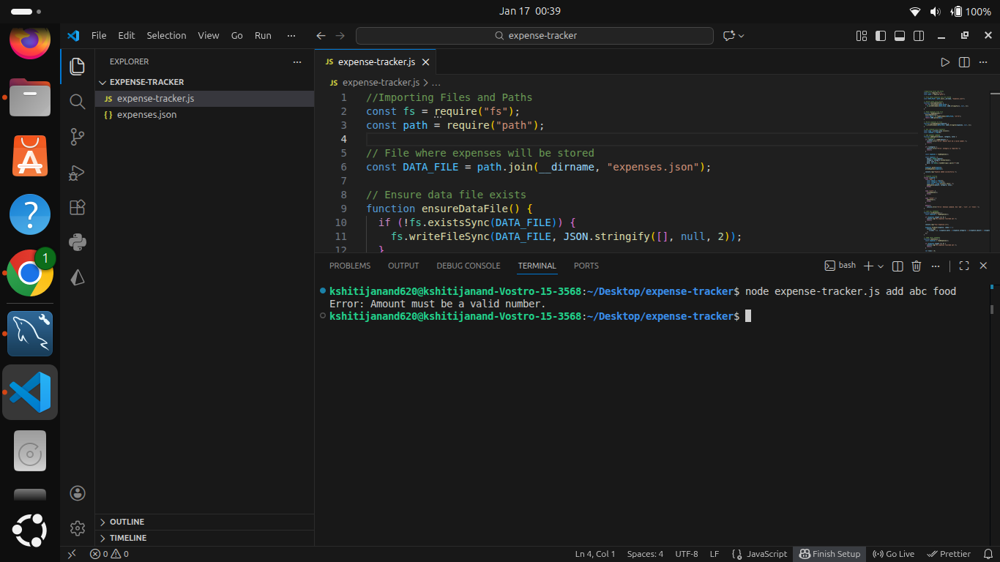

# cli-based-expense-tracker
A  command-line expense tracker built with Node.js to record, list, and analyze daily expenses.

---

## Sample Output Screenshots

### Add Expense

### List Expenses

### Total Expenses

### Error Handling
